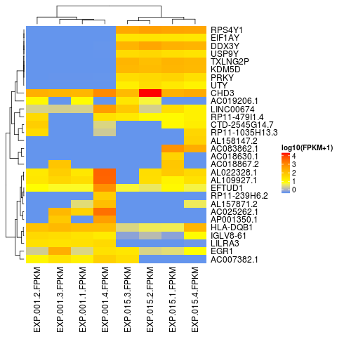

# countToFPKM
[![Build Status][bb]][travis]

[bb]: https://travis-ci.org/AAlhendi1707/countToFPKM.svg?branch=master
[travis]: https://travis-ci.org/AAlhendi1707/countToFPKM

## Overview
This package provides an easy to use function to convert the read count matrix into FPKM matrix:
- `fpkm()`
- `fpkmheatmap()`

 The `fpkm()` function requires three arguments to return FPKM as numeric matrix normalized 
 by library size and feature length:
 - `counts` a numeric matrix of raw feature counts. 
 - `featureLength` a numeric vector with feature lengths that can be obtained using   
   [biomaRt](https://bioconductor.org/packages/release/bioc/vignettes/biomaRt/inst/doc/biomaRt.html) package.
 - `meanFragmentLength` a numeric vector with mean fragment lengths, which can be calculated using the   
   [CollectInsertSizeMetrics(Picard)](https://broadinstitute.github.io/picard/command-line-overview.html#CollectInsertSizeMetrics) tool.
   
The `fpkmheatmap()` function provides the user with a quick and reliable way to generate FPKM heatmap plot of the highly variable features in RNA-Seq dataset. It takes an FPKM numeric matrix which can be obtained using `fpkm()` function as input. By default using Pearson correlation - 1 to measure the distance between features, and Spearman correlation -1 for clustering of samples. By default log10 transformation of (FPKM+1) is applied to make variation similar across orders of magnitude. It then using the var() function to identify the highly variable features to create the heatmap plot using the Heatmap() function from the 'ComplexHeatmap' package.
  
## Installation
```r
## Install
if(!require(devtools)) install.packages("devtools")
devtools::install_github("AAlhendi1707/countToFPKM")
```

## Usage example
```r
library(countToFPKM)

file.readcounts <- system.file("extdata", "RNA-seq.read.counts.csv", package="countToFPKM")
file.annotations <- system.file("extdata", "Biomart.annotations.hg38.txt", package="countToFPKM")
file.sample.metrics <- system.file("extdata", "RNA-seq.samples.metrics.txt", package="countToFPKM")

# Import the read count matrix data into R.
counts <- as.matrix(read.csv(file.readcounts))

# Import feature annotations. 
# Assign feature lenght into a numeric vector.
gene.annotations <- read.table(file.annotations, sep="\t", header=TRUE)
featureLength <- gene.annotations$length

# Import sample metrics. 
# Assign mean fragment length into a numeric vector.
samples.metrics <- read.table(file.sample.metrics, sep="\t", header=TRUE)
meanFragmentLength <- samples.metrics$meanFragmentLength

# Return FPKM into a numeric matrix.
fpkm_matrix <- fpkm (counts, featureLength, meanFragmentLength)

# Plot log10(FPKM+1) heatmap of top 30 highly variable features
fpkmheatmap(fpkm_matrix, topvar=30, showfeaturenames=TRUE, return_log = TRUE)
```


## Contributing
Please [submit an issue][issues] to report bugs or ask questions.

Please contribute bug fixes or new features with a [pull request][pull] to this
repository.

[issues]: https://github.com/AAlhendi1707/countToFPKM/issues
[pull]: https://help.github.com/articles/using-pull-requests/
[ref]: https://github.com/AAlhendi1707/countToFPKM/blob/master/doc/countToFPKM-manual.pdf
