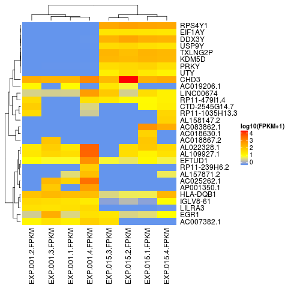

# countToFPKM
Convert counts to Fragments Per Kilobase of transcript per Million mapped reads (FPKM).

## Overview
This package provides an easy to use function to convert the read count matrix into FPKM matrix:
- `fpkm()`
- `fpkmheatmap()`

 The `fpkm()` function requires three arguments to return FPKM as numeric matrix normalized by library size and feature length:

 - `counts` a numeric matrix of raw feature counts. 
 - `featureLength` a numeric vector with feature lengths that can be obtained using   
   [biomaRt](https://bioconductor.org/packages/release/bioc/vignettes/biomaRt/inst/doc/biomaRt.html).
 - `meanFragmentLength` a numeric vector with mean fragment lengths, which can be calculated with   
   [Picard](https://broadinstitute.github.io/picard/command-line-overview.html#CollectInsertSizeMetrics)
   using CollectInsertSizeMetrics.
   
The `fpkmheatmap()` provides the user with a quick and reliable way to generate FPKM heatmap plot of the highly variable features in RNA-Seq dataset. This function returns FPKM heatmap plot, (by default using Pearson correlation - 1 to calcualte the distance measurments between features, and Spearman correlation -1 for clustering of samples). It takes that fpkm numeric matrix from the fpkm() function as input. It then using the var() function to identify the list of highly variable features to plot using Heatmap() function from "ComplexHeatmap" package.
  
## Installation
```r
## Install
if(!require(devtools)) install.packages("devtools")
devtools::install_github("AAlhendi1707/countToFPKM")
```

## Usage example
```r
library(countToFPKM)

#Import the read count matrix data into R.
counts <- as.matrix(read.csv("RNA-seq.read.counts.csv"))

#Import feature annotations. The length of items should be as the same of rows in read count matrix.
# Assign feature lenght into a numeric vector.
feature.annotations <- read.table("feature.annotations.hg38.txt", sep="\t", header=TRUE)
featureLength <- feature.annotations$length

#Import sample metrics. The length of items should be as the same of columns in read count matrix.
# Assign mean fragment length into a numeric vector.
samples.metrics <- read.table("RNA-seq.samples.metrics.txt", sep="\t", header=TRUE)
meanFragmentLength <- samples.metrics$meanFragmentLength

#Return FPKM into a matrix.
fpkm <- fpkm (counts, featureLength, meanFragmentLength)

#Plot log10(FPKM+1) heatmap of top 30 highly variable features
fpkmheatmap(fpkm_matrix, topvar=30, showfeaturenames=TRUE, return_log = TRUE)
```


## Contributing
Please [submit an issue][issues] to report bugs or ask questions.

Please contribute bug fixes or new features with a [pull request][pull] to this
repository.

[issues]: https://github.com/AAlhendi1707/countToFPKM/issues
[pull]: https://help.github.com/articles/using-pull-requests/
[ref]: https://github.com/AAlhendi1707/countToFPKM/blob/master/doc/countToFPKM-manual.pdf
